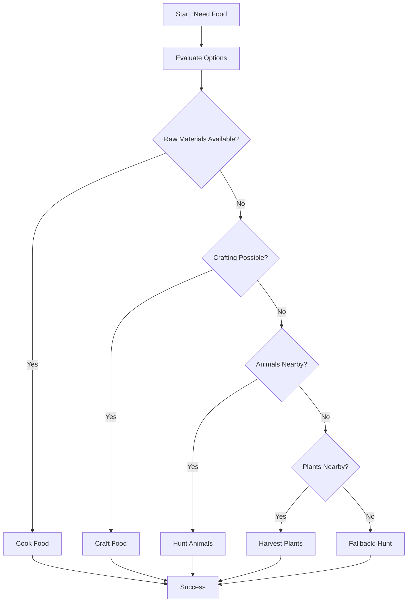

# Smart Food System

## Übersicht

Das Smart Food System ist ein intelligentes Nahrungsbeschaffungssystem für den Minecraft Bot. Es analysiert automatisch die verfügbaren Ressourcen und wählt die beste Methode zur Nahrungsbeschaffung aus.

## Features

### 🎯 Intelligente Food-Auswahl

Das System bewertet alle verfügbaren Food-Optionen basierend auf:
- **Verfügbarkeit**: Welche Zutaten/Tiere sind bereits vorhanden?
- **Priorität**: Wie nahrhaft ist das Essen?
- **Schwierigkeit**: Wie aufwändig ist die Beschaffung?

### 🍖 Nahrungsquellen

#### 1. **Gekochtes Essen** (Furnace/Smoker/Campfire)
- Baked Potato (5 ♥)
- Cooked Beef (8 ♥)
- Cooked Porkchop (8 ♥)
- Cooked Chicken (6 ♥)
- Cooked Mutton (6 ♥)
- Cooked Rabbit (5 ♥)
- Cooked Cod/Salmon (5-6 ♥)

#### 2. **Gecraftetes Essen** (Crafting Table)

**Einfach:**
- Bread (5 ♥) - 3x Wheat
- Cookie (2 ♥) - 2x Wheat + 1x Cocoa Beans

**Soups & Stews:**
- Mushroom Stew (6 ♥) - Bowl + 2x Mushrooms
- Beetroot Soup (6 ♥) - Bowl + 6x Beetroot
- Rabbit Stew (10 ♥) - Bowl + Cooked Rabbit + Carrot + Baked Potato + Mushroom

**Premium:**
- Pumpkin Pie (8 ♥) - Pumpkin + Sugar + Egg
- Cake (14 ♥) - 3x Wheat + 2x Sugar + 1x Egg + 3x Milk Bucket

#### 3. **Rohes Essen**

**Pflanzen sammeln:**
- Apple, Sweet Berries, Glow Berries
- Carrot, Potato, Beetroot
- Melon Slice

**Tiere jagen:**
- Cow → Beef
- Pig → Porkchop
- Chicken → Chicken
- Sheep → Mutton
- Rabbit → Rabbit

## Verwendung

### In Idle Task Generator

Das System wird automatisch vom Idle Task Generator aufgerufen, wenn der Bot wenig Nahrung hat:

```javascript
import { smartObtainFood } from './library/systems/food_system.js';

// Automatischer Aufruf
const result = await smartObtainFood(bot, 5); // 5x Nahrung beschaffen

if (result.success) {
    console.log(`Food obtained: ${result.foodObtained}x ${result.foodType}`);
}
```

### Manueller Aufruf

```javascript
import { SmartFoodManager } from './library/systems/food_system.js';

const foodManager = new SmartFoodManager(bot);
const result = await foodManager.obtainFood(10); // 10x Nahrung beschaffen
```

## Prioritätssystem

Das System bewertet Food-Optionen nach folgenden Kriterien:

1. **Sehr Hoch (9-10)**: Cooked Beef, Cooked Porkchop, Rabbit Stew
2. **Hoch (7-8)**: Baked Potato, Bread, Pumpkin Pie
3. **Mittel (5-6)**: Cooked Chicken, Mushroom Stew, Cookies
4. **Niedrig (1-4)**: Rohes Essen, Golden Carrots (zu teuer)

## Ablauf



## Logging

Das System verwendet **ausschließlich `appLog()`** für alle Log-Ausgaben. Nur wichtige Erfolgsmeldungen werden in den Server-Chat geschrieben:

```javascript
// Log nur in Console/File
appLog('🍖 Smart Food System: Finding best food source...');

// Wichtige Meldung an User
bot.chat('✅ Ich habe 5x Baked Potato hergestellt');
```

## Beispiele

### Beispiel 1: Kochen

```
Verfügbar: 5x Potato, 1x Furnace

Ablauf:
1. Evaluate Options → Baked Potato (Priority: 8)
2. Check Furnace → Found at (100, 64, 200)
3. Cook 5x Potato → 5x Baked Potato
4. Result: Success ✅
```

### Beispiel 2: Craften

```
Verfügbar: 6x Wheat

Ablauf:
1. Evaluate Options → Bread (Priority: 8)
2. Check Ingredients → 6x Wheat (need 3x)
3. Craft 2x Bread
4. Result: Success ✅
```

### Beispiel 3: Jagen

```
Verfügbar: 3x Cow nearby

Ablauf:
1. Evaluate Options → Hunt Cow (Priority: 5)
2. Hunt 3x Cow → 3x Beef
3. Result: Success ✅
```

## Integration mit anderen Systemen

### Material Planner
Das Food System arbeitet zusammen mit dem Material Planner für:
- Intelligente Ressourcenplanung
- Inventar-Management
- Crafting-Optimierung

### Idle Task Generator
Wird automatisch aufgerufen wenn:
- `memory.hasEnoughFood(3)` → `false`
- Bot ist idle
- Kein Cooldown aktiv (60 Sekunden)

## Fallback-Strategie

Falls das Smart Food System keine Option findet:
1. Versuche einfaches Jagen (Kühe, Schweine, Hühner)
2. Sammle 3 Tiere
3. Falls erfolgreich → Beende Task
4. Falls nicht → Warte auf nächste Idle-Prüfung

## Konfiguration

### Prioritäten anpassen

In `food_system.js`:

```javascript
cooked: {
    baked_potato: {
        raw: 'potato',
        nutrition: 5,
        priority: 8  // ← Hier anpassen
    }
}
```

### Neue Rezepte hinzufügen

```javascript
crafted: {
    my_custom_food: {
        ingredients: {
            item1: 2,
            item2: 1
        },
        nutrition: 7,
        priority: 6,
        requiresCraftingTable: true
    }
}
```

## Technische Details

### Klassen

- **SmartFoodManager**: Hauptklasse für Food-Management
- **FOOD_RECIPES**: Datenbank mit allen Food-Rezepten

### Methoden

- `obtainFood(amount)`: Hauptmethode - beschafft Nahrung
- `evaluateFoodOptions(inventory)`: Bewertet verfügbare Optionen
- `acquireFood(option, amount)`: Beschafft spezifische Food-Option
- `cookFood(option, amount)`: Kocht rohes Essen
- `craftFood(option, amount)`: Craftet Essen
- `huntForFood(option, amount)`: Jagt Tiere
- `harvestFood(option, amount)`: Erntet Pflanzen

## Debugging

Aktiviere Debug-Logging:

```javascript
// In food_system.js
this.appLog = (msg) => {
    console.log(`[FOOD] ${msg}`);
    appLog(msg);
};
```

## Bekannte Limitationen

1. **Fishing** ist noch nicht implementiert
2. **Suspicious Stew** wird vermieden (unvorhersehbare Effekte)
3. **Golden Apples/Carrots** haben niedrige Priorität (zu teuer)

## Zukünftige Erweiterungen

- [ ] Fishing-Integration
- [ ] Farm-Management (automatisches Anbauen)
- [ ] Nahrungsvorrat-Planung (Langzeit-Survival)
- [ ] Effekt-basierte Food-Auswahl (z.B. Golden Apples vor Kämpfen)

---

**Autor**: Dudu AI Team
**Basierend auf**: https://minecraft.fandom.com/wiki/Food
